# Behavioral Cloning Project

The code and writeup contained in this repository is my submission for the third Udacity self driving car nano-degree project. The aim of the project is to collect driver behaviour data and use it to train a neural network which will then be able to drive a car around a track. 

For a successful submission in this project it must be shown that the trained network is able to drive the car around the track once. A second track is also avaliable in the simulator and if possible it would be good if the car could drive around this track too.

The approach I took to the second track was that becuase it is not necessary to complete a lap of the second track to submit the project I thought I would have some fun with it. Therefore I decided I would only train my network with data collected from the first track and see if I could derive a model which was generalisable enough to drive around the second track as well. To try to accomplish this task I first tried to augment the data to simualte the conditions of the second track. That included simulating sharper corners, steeper road angles and shadows across the track. I also built a network which sould control the speed and steering of the car.

Test Track for Submission | Second Test Track
--------------------------|--------------------------
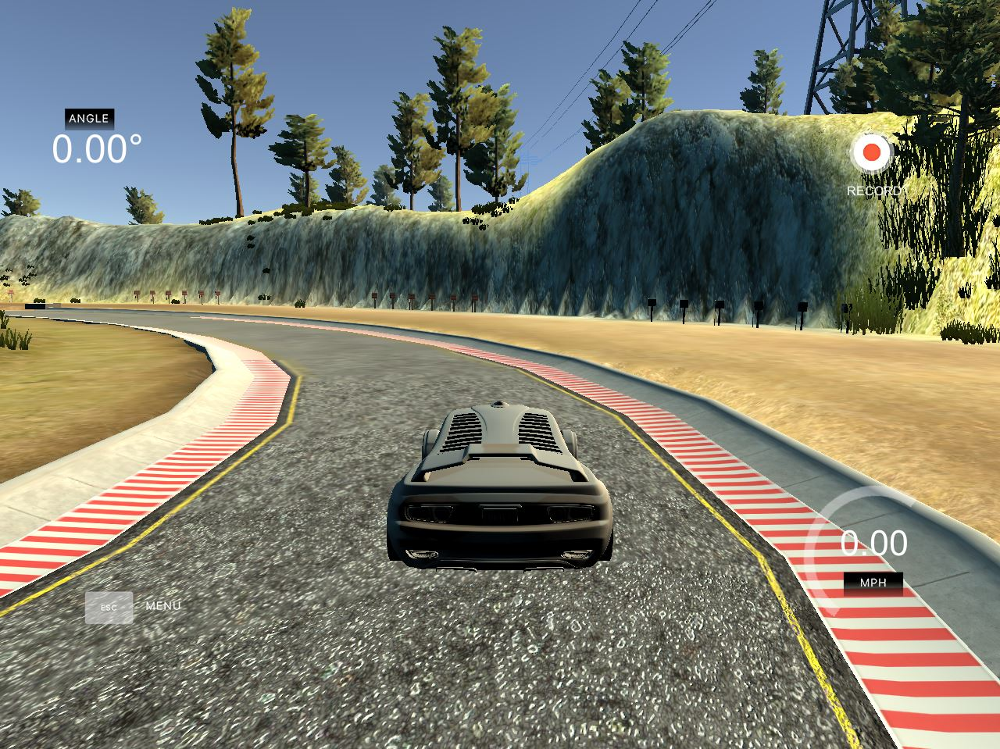|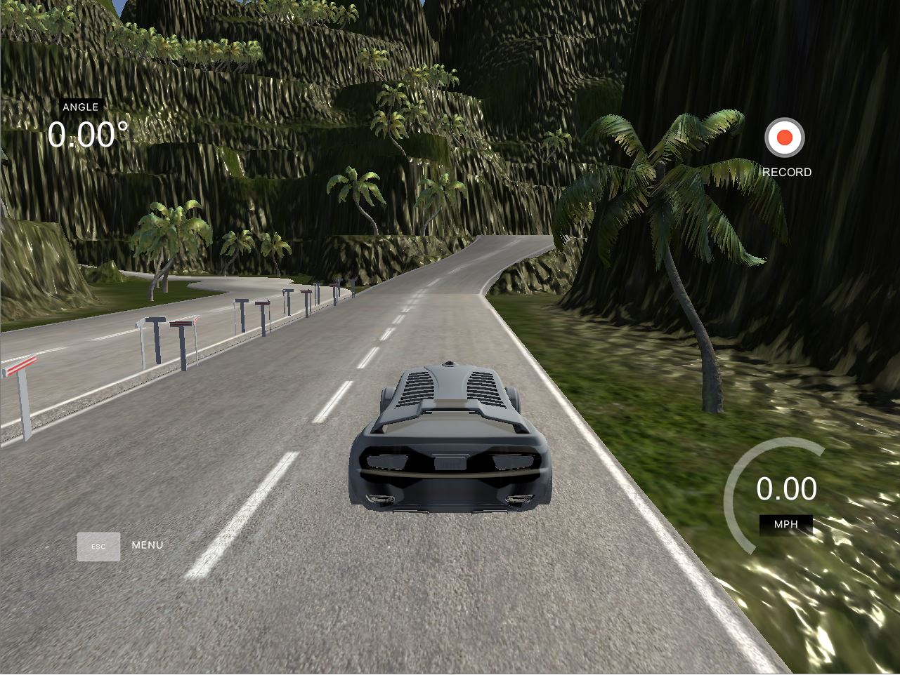

## Prior Work

NVIDIA developed an [end to end method of driving a car](https://arxiv.org/abs/1604.07316) using a Convolutional Neural Network to control the steering of a car. That is they trained a network that took images from a central forward facing camera as an input and used steering angle as the trainable output. They posit that this method will eventually allow for better performance from smaller systems as the network internally learns to look for important road features. This approach is in contrast to the method of a human predefining features to look for such as lane markings etc. Interestingly in the paper they show that the network does learn to look for the same salient features for predicting the required steering angle that a human would.

## Data Collection

To train an end to end network to drive a car we need data and this is collected using the [Udacity driving simulator](https://github.com/udacity/self-driving-car-sim).
The car is driven around the track using the mouse to control the steering and your arrow keys to control the throttle and brakes. The simulator records the image data and the telemetry data. The telemetry data is recorded in a csv file formatted as shown in the table below.

Centre Image | Left Image | Right Image | Steering Angle | Throttle Value | Brake Value | Speed Value 
-------------|-------------|-------------|-------------|-------------|-------------|-------------
IMG/center.jpg | IMG/left.jpg | IMG/right.jpg | 0.0617599 | 0.9855326 | 0 | 2.124567

Initially I tried to collect my own data. I recorded 1 lap of the car driving in each direction. The track is essentially a loop and by collecting data with the car driving in both directions this ensured that my data did not have a bias towards left or right hand turns. As I progressed through the project I found that the quality of the data I collected was not very good, that is I was not very good at driving the car in the simulator. To overcome this I trained my final model using the [Udacity data set](https://www.dropbox.com/s/2mfk5a2v2zymr3e/Dataset.zip?dl=0).

## Data Augmentation

For me an important lesson from the previous project Traffic sign classifier was that for data augmentation to be worthwhile it must be done in a manner such that the augmented data generated is realistic and relevant. For example randomly flipping images upside down will be of no benefit. However flipping the images through the vertical axis will be of benefit as it simulates driving around corners in the opposite diretion. 

A second method of data augmentation I used utilised the cameras on the sides of the vehicle which are recording concurrently with the central camera image from the simulator. This allows me to collect data in which it appears the vehicle is vearing the side of the track. Further to this I leaned heavily on an article by [Vivek Yadav](https://chatbotslife.com/using-augmentation-to-mimic-human-driving-496b569760a9) on the data augmentation techniques he used when he did this project. I shamelessly borrowed two techniques the first was to simulate greater angles and gradients and the second was to simulate shadows over the track.

### Side View Cameras

Centre Camera Image | Left Camera Image | Right Camera Image
------------------|------------------|------------------|
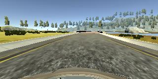 ||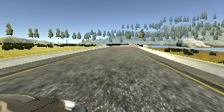

To generate the steering angles for the side view cameras I applied a correction factor to the steering angles.

    #steering correction factor
    correction = 0.2 
    #loop through three image as listed in driving log
    for i in range(3):
        #load filename from driving log
        name = batch_sample[i].split('/')[-1]
        
        #import image using opencv and convert colour space from BGR to RGB
        image = cv2.cvtColor(cv2.imread(name),cv2.COLOR_BGR2RGB)
        
        #for the centre image the steering angle 
        #is that which has been recorded
        if i == 0:
            angle = float(batch_sample[3])
        
        #for the left camera image the car needs 
        #to steer to the right so the correction factor
        #is added to the recorded steering angle
        elif i == 1:
            angle = float(batch_sample[3]) + correction
            
        #for the right camera image the car needs
        #to steer to the left so the correction factor
        #is subtracted from the recorded steering angle            
        elif i == 2:
            angle = float(batch_sample[3]) - correction
            
This additional data allows the car to learn what to do if the vehicle is not aligned with the road centre line.

### Flipping Images Through Vertical Axis

To flip images through the veritcal axis I used the opencv flip function.

    imageFlip = cv2.flip(image,1)
   
I inverted the steering angle simply by multiplying the steering angle by the float -1.0

    angle = angle*-1.0

Image Input | Flipped Image
------------|------------
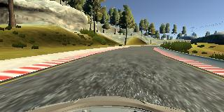|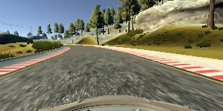|
Steering Angle| Flipped Steering Angle
0.243562 | -0.243562

### Angle and Gradient Simulation

To further suplement the data I applied translations to the image to simulate the car driving up and down hills. This was done by by applying vertical translations to the image data. I also applied horizontal translations to the image data to further supplement data for cornering.

To translate the image I defined a function to take an image and shift it a given number of pixels horizontally and vertically using the opencv function warpAffine.

    def translate_image(image,tr_x,tr_y):
        # Translation
        rows = image.shape[0]
        cols = image.shape[1]
        Trans_M = np.float32([[1,0,tr_x],[0,1,tr_y]])
        image_translate = cv2.warpAffine(image,Trans_M,(cols,rows))
        return image_translate

A second function is defined to generate a steering angle to accompany the translated image. The constants applied to the translation function are taken directly from Vivek's blog post.

    def translate_angle(angle, tr_x, trans_range):
        angle_translate = angle + tr_x/trans_range*2*.2   
        return angle_translate

In the main augmentation code I generate a random translation factor in x and in y which I then pass to both translation functions.

    trans_range=60
    tr_x = trans_range*np.random.uniform()-trans_range/2
    tr_y = 40*np.random.uniform()-40/2
    images.append(translate_image(image, tr_x, tr_y))
    angles.append(translate_angle(angle, tr_x, trans_range))
                    
Input Image | Translated Image Example 1 | Translated Image Example 2 | Translated Image Example 3
------------|------------|------------|------------
 |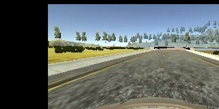|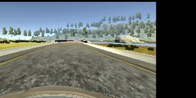|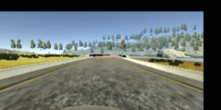
Steering Angle | Augmented Steering Angle | Augmented Steering Angle | Augmented Steering Angle 
0.0617599 | 0.2400561 | -0.030398 | 0.0493373

### Random Shadow Augmentation

I also copied Vivek Yadavs method of simulating shadows across the image. There are changes in the colour of the road however this augmentation technique is more relevant to the second track where there are a number of points around the track where shadows are cast accross the road. The method works by transferring the image to the Hue Saturation and Lightness colour space. Then the lightness value is adjusted across a random portion of the image. Finally the image is converted back the RGB colour space.

    def shadow_aug(image):
        top_y = 320*np.random.uniform()
        top_x = 0
        bot_x = 160
        bot_y = 320*np.random.uniform()
        image_hls = cv2.cvtColor(image,cv2.COLOR_RGB2HLS)
        shadow_mask = 0*image_hls[:,:,1]
        X_m = np.mgrid[0:image.shape[0],0:image.shape[1]][0]
        Y_m = np.mgrid[0:image.shape[0],0:image.shape[1]][1]

        shadow_mask[((X_m-top_x)*(bot_y-top_y) -(bot_x - top_x)*(Y_m-top_y) >=0)]=1
        if np.random.randint(2)==1:
            random_bright = .5
            cond1 = shadow_mask==1
            cond0 = shadow_mask==0
            if np.random.randint(2)==1:
                image_hls[:,:,1][cond1] = image_hls[:,:,1][cond1]*random_bright
            else:
                image_hls[:,:,1][cond0] = image_hls[:,:,1][cond0]*random_bright    
        image = cv2.cvtColor(image_hls,cv2.COLOR_HLS2RGB)
        return image

Input Image | Translated Image Example 1 | Translated Image Example 2 | Translated Image Example 3
------------|------------|------------|------------
 |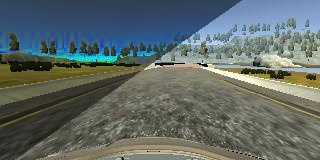|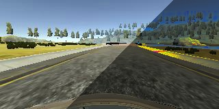|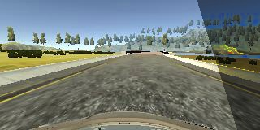

This augmentation technique does not simulate a shift in the camera and therefore the steering angle which accompanies this augmentation technique is that recorded for the centre camera or derived for the left and right hand cameras as outlined earlier.
 
## Network Architecture
The first network I used was based on the LeNet architecture that we used in previous projects. That network was reasonable but it did not complete a lap of the test track and so I have not included the results on this report.

I then built the NVIDIA network using keras 1.0 and tensorflow 1.3. I used their network architecture with some minor modifications.
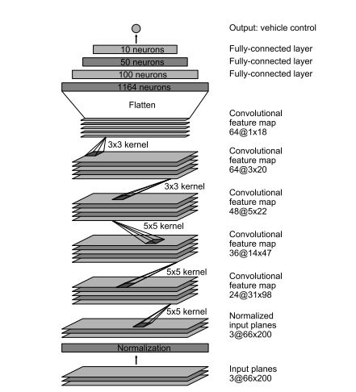
To reduce over fitting I included a dropout layer between each of the fully connected layers. I used an Adam optimizer to control the learning rate parameters.

## Results
### First Test Track
This video shows the view from the centre camera as the car drives around the track controlled by the NVIDIA network.

### Second Test Track
This video shows the view from the centre camera as the car drives around the second track. As you can see it crashes almost immediatly.

## Second Network Architecture
For fun I decided to design a netwrok architecture that would allow the car to control the steering and speed of the car. I built the network using the functional API from keras2.0 and TensorFlow1.3. The network essentially copies the NVIDIA network but I added seperate fully connected layers to control the speed of the car. I only used additional fully connected layers as my thinking is that the convolutional layers understand the image and the fully connected layers make the decisions based on what is in the image - I might have the wrong end of the stick here.
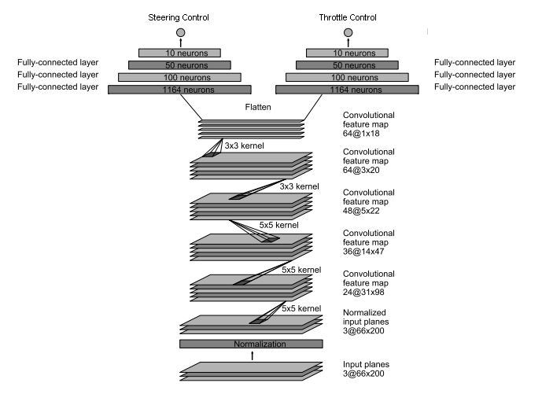

### Speed Control Data Augmentation
I added a method of augementating speed control values. For images where I applied a translation to the image I decreased the throttle value as you would drive the car slower whilst cornering.

    def translate_throttel(throttle, tr_x, tr_y, trans_range):
    throttel_translate = throttle - (tr_x/trans_range)*.2 - (tr_y/trans_range)*.4
    if throttel_translate > 1:
        throttel_translate = 1
    elif throttel_translate < 0:
        throttel_translate = 0
    return throttel_translate

### Changes to drive.py
I modified the drive.py file to allow control of the throttle and steering. The modified file is in the repository as drive_steer_throttle.py

    steering_angle = float(model.predict(image_array[None, :, :, :], batch_size=1)[0])
    throttle = float(model.predict(image_array[None, :, :, :], batch_size=1)[1])

### Steering and Speed Network on First Test Track
The car does not drive around the first track as well as the NVIDIA network, it is a bit unsteady. This could potentially be solved by running the network for another epoch however the network took a number of hours to train so I haven't done that.

### Steering and Speed Network on Second Test Track
The car performs equally poorly on the second test track.

## Conclusions
This repo contains code which has repeated NVIDIA's end-to-end method of controlling the steering of a car using a convolution neural network. The car has successfully negotiated the first track. An attempt was made to make the model generaliable enough to negotiate the second track purly through data augmentation, though this was unsuccessful. The second track had a number of more complicated features on the track including road signs, changes in gradient, shadows and sharper corners. I am pretty confident that if I had collected data from driving around the second track for training the network that this network would be able to succesfully negotiate the second track.

The repo also contains code and a network to control the steering and speed of the car. While the model was able to negotiate the second track it was more usnteady than the standard network. With more time and effort I suspect I could get the steering to a similar standard but the network does take much longer to train so I haven't had time to do that at this point.
